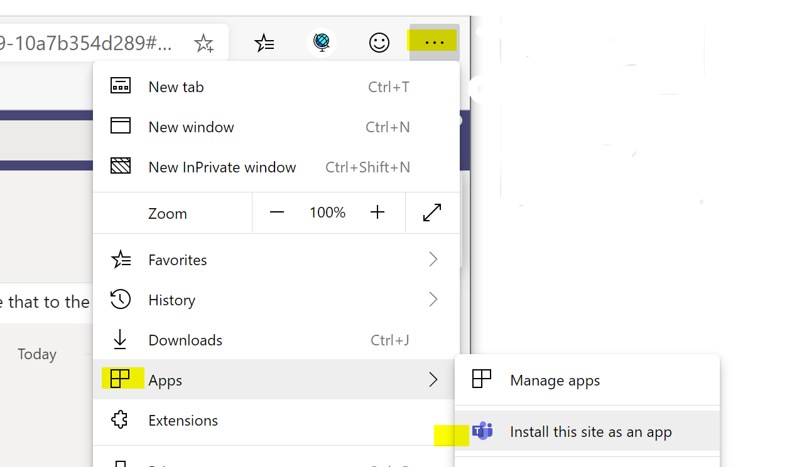
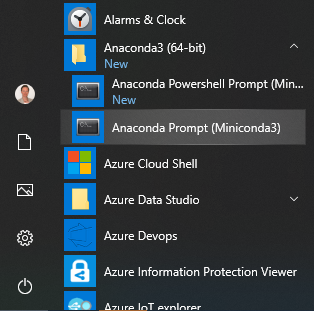
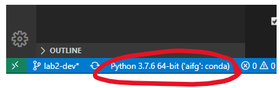

[< back](../Lab2.md#The-Plan-for-the-Day)

# Tips and Tricks
<!--
### Some tips and tricks to feel at home in the cloud:

From the Azure ML lab in the first fundamentals session, you will have got a good idea of the intended use of the `Datasets` feature to manage, version, and track your datasets through the ML development process. Sometimes, however, you just want to get started quickly with some data for some brief experiements: 
-->

#### Contents:
<!-- 
- [Connect to your VM from VScode](#ConnecttoyourDSVMfromVSCode)
- [Mount blob storage into your VM wiht blobFuse](#MountblobstorageintoyourAMLVirtualMachineswithblobFuse)
-->
- [Get an Azure Portal App on your machine with Edge beta](#Get-an-Azure-Portal-App-on-your-machine-with-Edge-beta)
- [Working with Conda](#working-with-conda)

<!--### Connect to your DSVM from VScode
VS code has a great little trick to feel like you've really beefed up your local machine: Develop as if on your local machine, but execute on a remote machine, such as your Azure ML Data Science Virtual Machine (DSVM).

- Create a DSVM in Azure ML with SSH option enabled
- Create an SSH Key
- Install VSCode Remote Development Pack
- Update config file (via command menu)
- Connect to Remote
-->

<!--### Mount blob storage into your AML Virtual Machines with blobFuse

[Add instructions here]
-->


## Get an Azure Portal App on your machine with Edge beta
[](https://shields.io/)

> 💡 This tip is especially useful if you have multiple windows accounts. 

1. Download the beta version of edge from here: https://www.microsoftedgeinsider.com/en-gb/download.
2. Create a guest browser profile that you can use with the windows account you want to use with this Azure Portal App.
3. Go to https://portal.azure.com and sign in.
4. Once you are on the page that should be the starting page of your app, go to the browser menu and select `Apps` > `Install this site as an app`.

    

Your new app will now appear in your start menu. 

This works equally well for the azure cloud shell (https://shell.azure.com) or any other webpage you'd like to lift out of 'too-many-tabs-hell'!

<pre>


</pre>

## Working with Conda

[](https://shields.io/)

Conda helps you manage python environments on your local machine, keeping your system python free of packages that you may need for your python experiments. 

#### Install Miniconda on Linux or WSL
> -> https://gist.github.com/lindacmsheard/f0714f3e5870491e3f2eaa70ae677a1e


#### Install Conda on Windows

> -> https://docs.conda.io/en/latest/miniconda.html

This also installs the anaconda prompt on your system, which can be launched from the start menu.



The Anaconda Prompt allows you to manage your conda environments. 

It launches with the base environment activated, denoted by `(base)` before the prompt. 

To create a new environment, for example with python 3.6 and the scipy package:
```
conda create -n myenv python=3.6 scipy
```
Then activate that environment with
```
conda activate myenv
```
For more options on managing environments, see the documentation [here](https://docs.conda.io/projects/conda/en/latest/user-guide/tasks/manage-environments.html).

### To use Conda within VScode on Windows
The above installation recommends not to add conda to the system PATH, and instead to use the Anaconda Prompt that the installation provisions. 

To be able to execute conda commands, such as those for managing environments, from within the VSCode terminal:
- restart VScode from the Anaconda Prompt (using `code .`), **after** the conda installation and **after** creating any new environments that need to be available to VScode in the anaconda prompt
- install the VScode python extension, if not present
- set python interpreter (Ctrl + Shift + P) to bring up the command pallette, type "Python: Select Interpreter" and select your miniconda installation and desired environment.

The conda environment in use is noted in the VScode footer:

