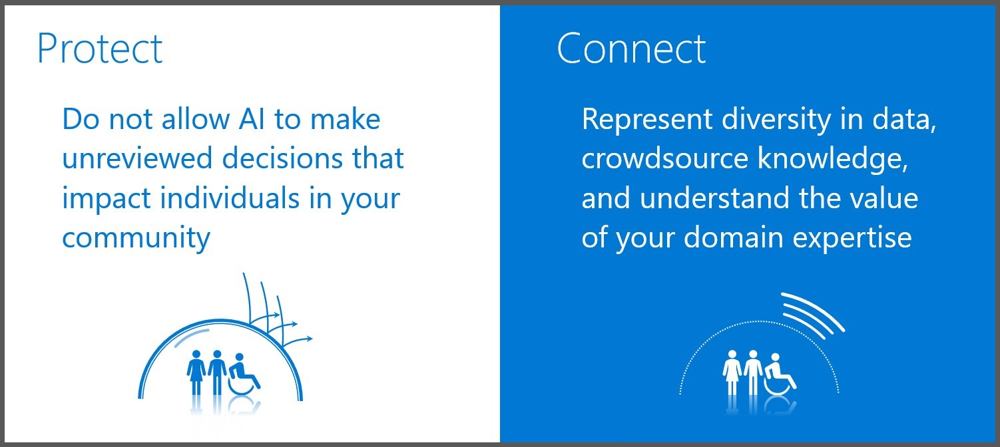

[< back](../Lab2.md)

# Responsible AI in Practice
[Dr Linda C M Sheard](https://www.linkedin/in/lindacmg)

[Benedict Faria](https://www.linkedin.com/in/benedict-faria-117a51/)

[-- shared link to presentation deck and replay to follow --]

## Links and references
#### Envisioning
- AI Business School: https://www.microsoft.com/en-us/ai/ai-business-school
- Microsoft AI Principles: https://www.microsoft.com/en-us/AI/our-approach-to-ai
- Deloitte AI Ethics Step by Step: https://www2.deloitte.com/us/en/pages/regulatory/articles/ai-ethics-responsible-ai-governance.html

#### Tools for mitigating biases:
- The Fairlearn project: https://github.com/fairlearn/fairlearn
- Azure Data Drift: https://docs.microsoft.com/en-us/azure/machine-learning/how-to-monitor-datasets
- Azure ML Explainable AI:  https://docs.microsoft.com/en-us/azure/machine-learning/how-to-machine-learning-interpretability

#### Inspiration:
- Intelligent Kiosk: https://www.microsoft.com/en-gb/p/intelligent-kiosk/9nblggh5qd84
- Personalisation plugin: https://www.ventureharbour.com/wordpress-content-personalization/
