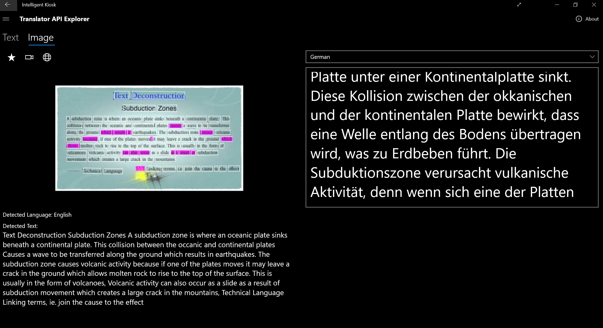
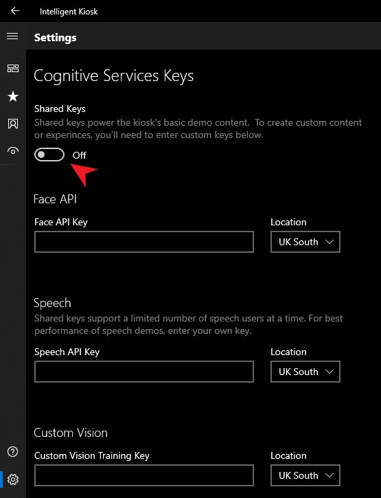

[< back](../Lab2.md#The-Plan-for-the-Day)

# Lab 2.1: Getting started with Cognitive Services
Duration: 1 - 1.5 hours

This session introduces you to to working with pre-trained models from the Azure Cognitive Services, and enables you to explore their capabilities.
<!---

-->
## 1. Explore the Azure Cognitive Services with the Intelligent Kiosk

**Option 1**: Install the pre-compiled Intelligent Kiosk App

The pre-compiled Kiosk is great for an initial look. This version uses some preconfigured API keys so you can get going straight away.

Step 1: Download the Kiosk app from the Microsoft App Store here: https://www.microsoft.com/en-gb/p/intelligent-kiosk/9nblggh5qd84

Step 2: [TODO] walk through a sample scenario here - let's do this one - it's cool to also show the OCR
https://github.com/microsoft/Cognitive-Samples-IntelligentKiosk/blob/master/Documentation/TranslatorExplorer.md

*Note: If you speak another language, note some of the subtleties when using OCR: for example, an erroneous recognition of the word 'oceanic' as 'occanic' in this picture results in a best-guess german translation of 'okkanisch'.*

**Option 2**: Run the Kiosk locally with Visual Studio

Step 0: Install Visual Studio

Step 1: Clone the following repo to your machine:

https://github.com/Microsoft/Cognitive-Samples-IntelligentKiosk

Step 2: Follow the guidance on [this](https://github.com/Microsoft/Cognitive-Samples-IntelligentKiosk#Running-the-sample) page to load the Kiosk solution into Visual Studio 

<!--- probably update step 2 to put instructions inline, so as not to confuse the API configuration step -->

Next: This local version does not have any preconfigured API connections [TODO - verify this!], so please move on to 2. below to provision your own.

## 2. Provision your own Cognitive Services instances

In this section, we will show you how to obtain your own API keys for cognitive services with your subscription. 

You can connect these to your Kiosk, or explore below other ways of interacting with these service instances.

**Option 1:** Use the Azure portal - an example

Here, we'll use the Azure portal to obtain your own API key for the [tbc] service that you will also be working with this afternoon.

<pre>

TODO: add or link instructions

</pre>

**Option 2:** Set up all required services with an azure-cli script 

The following script provisions an instance of the cognitive services required by the Intelligent Kiosk, and returns your API keys.

[ToDo - verify this works]
https://github.com/microsoft/Cognitive-Samples-IntelligentKiosk/blob/master/KeyAcquisitionScript.md

## 3. Connect to your Cognitive Service

### To connect Kiosk application to your own service instances

Add your API keys to the 'settings' page of the Kiosk application.

Click on  in the bottom left corner of the Kiosk application.

Under Cognitive Services Keys, set `Shared Keys` to off, and enter your API keys in the relevant fields.

Explore some of the [documented scenarios](https://github.com/Microsoft/Cognitive-Samples-IntelligentKiosk#Scenarios) for relevance to your business 

### To interact with your cognitive services with python

For those of you with python skills, here is some sample code to help you learn how to interact with cognitive services with python.

[To Do: briefly describe what this code achieves / walk through one example fully]
- https://github.com/caiomsouza/Microsoft-Cognitive-Services
- https://github.com/caiomsouza/Microsoft-Cognitive-Services/tree/master/textanalytics

<pre>

</pre>

[next >](../Lab2.md#The-Plan-for-the-Day)