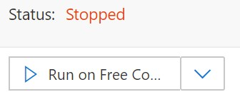

[< back](../lab2-2-guide.md)

*This sample is adapted from https://docs.microsoft.com/en-us/azure/cognitive-services/translator/quickstart-translate?pivots=programming-language-python*

## Introduction

This sample code demonstrates how to integrate a the Cognitive Translator Text API into a Jupyter Notebook. Jupyter Notebooks are useful for exploratory data science, and for prototyping your integrations in an interactive environment.
We have a number of options for working with Notebooks in the cloud. This lab walks through https://notebooks.azure.com, but you can also work with notebooks in the context of the Azure Machine Learning (AML) service that you got to know in [Workshop 1](../../../README.md).

### Lab objectives
- Get to know the Azure Cognitive Translation Service
- Work with jupyter notebooks for data science workflows and prototying on Azure

### Steps

1. Go to https://notebooks.azure.com, and select `Sign in` at the top right.
2. Go to `My Projects` on the top menu bar, and click `+ New Project`.
    - Give your project a name, and continue with the default options.
3. The cloud VM associated with your project will be in a stopped state. Click `Run on free compute` to start it.
    
    

    This will open a new tab with the standard Jupyter directory tree - note the url to your new free cloud VM in the address bar.

4.  Find the `upload` button on the right, and upload the [nb_translate.ipynb](nb_translate.ipynb) sample notebook in this repo.

5. Click on the notebook in the file list to launch it.

6. Add your API key to the second cell in the notebook, and then step through it by pressing `SHIFT + ENTER` on each cell, and observing the output.

    > 💡 a `[*]` in to the left of the cell indicates it is currently running. A digit - e.g. `[1]` - indicates the number of times it has been run. 

[Next >](../lab2-2-guide.md#4-integrate-the-speech-services-from-a-web-client-with-javascript)

<!--put guidance on jupyter notebooks
- via notebooks.azure.com
- via DSVM in AML
- (locally)
-->
